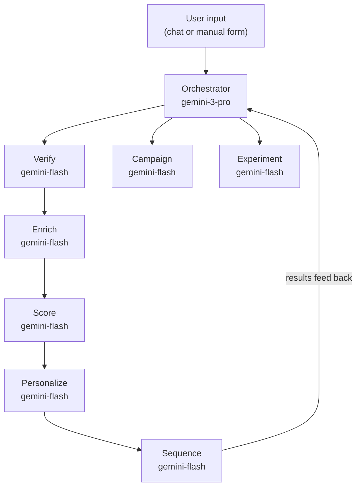

# Onboard GTM

Agentic outbound pipeline for Onboard — Africa's cross-border payments infrastructure.

## What This Is

A GTM system that automates the outbound loop: **Sources → Verify → Enrich → Score → Personalize → Sequence → Outreach → Measure → (loop back).**

The BD/Sales Manager opens this, adds leads (manually or via agent), and the system automatically enriches, scores, personalizes, and sequences outreach. The BD person focuses on conversations the system can't have.

## Architecture

**7 agents orchestrated through a main controller:**



| Agent | File | Purpose |
|-------|------|---------|
| Orchestrator | `lib/agents/orchestrator.ts` | Routes tasks, coordinates the loop |
| Verification | `lib/agents/verification.ts` | Checks duplicates, completeness, data quality |
| Enrichment | `lib/agents/enrichment.ts` | Detects buying signals from lead profile |
| Scoring | `lib/agents/scoring.ts` | Scores 0-100, assigns ICP segment |
| Personalization | `lib/agents/personalization.ts` | Generates outreach with `{{variables}}` |
| Sequencing | `lib/agents/sequencing.ts` | Decides send/wait/skip based on behavior |
| Campaign | `lib/agents/campaign.ts` | Generates templates, proposes A/B variants |
| Experiment | `lib/agents/experiment.ts` | Analyzes results, proposes tests |

## Stack

| Layer | Choice |
|-------|--------|
| Framework | Next.js 16 (App Router) |
| AI | `@ai-sdk/google` (Gemini 3 Pro + 3.1 Flash) |
| Memory | Mem0 (optional, self-hostable) |
| DevTools | `@ai-sdk/devtools` (dev mode) |
| Database | PostgreSQL (Neon) + Drizzle ORM |
| Flow | `@xyflow/react` (React Flow) |
| Types | TypeScript strict, inferred from Drizzle |

## Setup

```bash
npm install
```

Set in `.env.local`:
```
DATABASE_URL=postgresql://...
GOOGLE_GENERATIVE_AI_API_KEY=...
MEM0_API_KEY=                  # optional
```

```bash
npx drizzle-kit push
npm run dev
```

DevTools (separate terminal):
```bash
npx @ai-sdk/devtools
# opens localhost:4983
```

## Views

| Route | Purpose |
|-------|---------|
| `/` | Pipeline — stats, stage filters, lead table + detail panel |
| `/campaigns` | Templates with `{{variables}}`, A/B variants |
| `/results` | Experiment outcomes, metric tracking |
| `/leads/[id]` | React Flow — one lead's journey through the agent loop |

## Agent Interaction

- **Floating chat** (◈ button, bottom-right) — type commands or lead info. Agent responds with verification, enrichment, scoring, etc.
- **Manual add** (+ Add Lead button) — modal form for direct lead entry
- Agents run via `/api/agent` → orchestrator → all tools registered

## Database

6 tables, 4 Postgres enums, 8 indexes. Schema in `lib/db/schema.ts`. Types automatically inferred via Drizzle's `$inferSelect`/`$inferInsert`.

See `docs/architecture.md` for detailed agent contracts and file structure.
