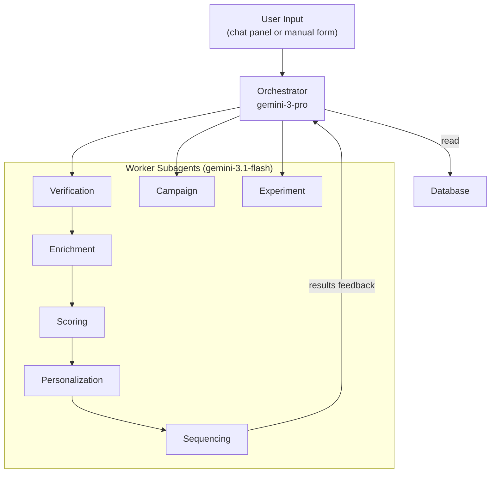

# Architecture

## Agent Architecture (Orchestrator-Worker)

The system uses the AI SDK's **orchestrator-worker** pattern. One main agent routes tasks to specialized subagents.



## Agent Contracts

### Orchestrator (`lib/agents/orchestrator.ts`)

The main controller. Receives user input (natural language via chat or structured data via form), routes to appropriate subagents, coordinates the loop.

**Model:** `google('gemini-3-pro-preview')`  
**Tools registered:** queryLeads, getLead, addSignal, addEvent, assignCampaign, getCampaignMetrics, verifyLead, enrichLead, scoreLead, generateOutreach, decideNextStep, generateCampaign, proposeExperiment  
**Memory:** Mem0 (when `MEM0_API_KEY` is set)

### Workers (all use `google('gemini-3.1-flash-lite-preview')`)

| Agent | File | Input | Output |
|-------|------|-------|--------|
| **Verification** | `verification.ts` | Raw lead data (company, country, etc.) | `{ isDuplicate, isComplete, isClean, missingFields[], issues[] }` |
| **Enrichment** | `enrichment.ts` | Lead ID + company/country/industry | `{ enrichment, icpFit, icpReasoning, signals[] }` — saves signals to DB |
| **Scoring** | `scoring.ts` | Lead ID + profile + signals | `{ score, segment, breakdown }` — updates lead in DB |
| **Personalization** | `personalization.ts` | Lead ID + profile + signals | `{ subject, body, cta }` — generated outreach message |
| **Sequencing** | `sequencing.ts` | Lead ID + score + events | `{ action: send_now|wait|skip|escalate }` — decides next step |
| **Campaign** | `campaign.ts` | Target segment | `{ campaignId, name, subjectA, subjectB, cta }` — saves to DB |
| **Experiment** | `experiment.ts` | Campaign ID + context | `{ metricTarget, variantA, variantB, hypothesis }` — saves to DB |

## Data Flow

```
User types "Lagos Freight Co, Nigeria, freight"
    │
    ▼
Orchestrator calls verifyLead({ company, country, industry })
    │
    ├─ isDuplicate → tell user, stop
    ├─ !isComplete → ask for missing fields, wait
    └─ isClean → proceed
        │
        ▼
    Orchestrator calls enrichLead({ leadId, company, country, ... })
        → detects signals, checks ICP fit
        → saves signals to DB
        │
        ▼
    Orchestrator calls scoreLead({ leadId, ... })
        → scores 0-100, assigns segment
        → updates lead in DB
        │
        ▼
    Orchestrator calls generateOutreach({ leadId, ... })
        → generates personalized message
        │
        ▼
    Orchestrator calls decideNextStep({ leadId, score, ... })
        → decides send_now / wait / skip
        │
        ▼
    Results feed back into the loop
```

## Provider & Memory

**Google Gemini** via `@ai-sdk/google`. Models defined in `lib/ai/model.ts`:
- `orchestratorModel`: `google('gemini-3-pro-preview')`
- `workerModel`: `google('gemini-3.1-flash-lite-preview')`

**DevTools** (`@ai-sdk/devtools`): models wrapped with `devToolsMiddleware()` in development. Run `npx @ai-sdk/devtools` to monitor agent calls at `localhost:4983`.

**Mem0** (`lib/ai/memory.ts`): wraps orchestrator model for persistent memory across sessions. Self-hostable. Requires `MEM0_API_KEY` and `GOOGLE_GENERATIVE_AI_API_KEY`.

## Database

PostgreSQL (Neon) via Drizzle ORM. Schema in `lib/db/schema.ts`.

**6 tables:** leads, signals, events, campaigns, templates, experiments  
**4 enums:** lead_state, lead_segment, signal_type, event_type  
**Types auto-inferred** via `typeof table.$inferSelect` / `$inferInsert`

## API Routes

| Route | Method | Purpose |
|-------|--------|---------|
| `/api/agent` | POST | Orchestrator endpoint — receives `{ messages }`, returns streamed agent response |

## User Interaction

**Agent Panel** (`components/agent-panel.tsx`): floating chat (◈ button, bottom-right). Type commands or lead info. Agent responds with verification, enrichment, scoring results.

**Manual Add**: + Add Lead button opens a modal form. Creates lead directly in the pipeline.

## File Structure

```
app/
  page.tsx                    # Pipeline view (stats, table, detail panel)
  layout.tsx                  # Root layout (Inter + JetBrains Mono)
  globals.css                 # Design system
  campaigns/page.tsx          # Campaign templates & A/B variants
  results/page.tsx            # Experiment results
  leads/[id]/
    page.tsx                  # Server component (await params)
    flow.tsx                  # React Flow — lead journey visualization
  api/agent/route.ts          # Orchestrator POST endpoint
components/
  agent-panel.tsx             # Floating chat panel
lib/
  agents/
    orchestrator.ts           # Main controller
    verification.ts           # Duplicate check, completeness validation
    enrichment.ts             # Signal detection
    scoring.ts                # ICP scoring, segmentation
    personalization.ts        # Outreach generation
    sequencing.ts             # Send timing decisions
    campaign.ts               # Template generation
    experiment.ts             # A/B test proposals
    tools/
      lead-tools.ts           # DB CRUD tools (queryLeads, getLead, etc.)
  ai/
    model.ts                  # Provider instances + DevTools
    memory.ts                 # Mem0 integration
  db/
    schema.ts                 # Drizzle schema + inferred types
    index.ts                  # DB client (Neon HTTP)
drizzle/
  0000_init.sql               # Generated migration
```
